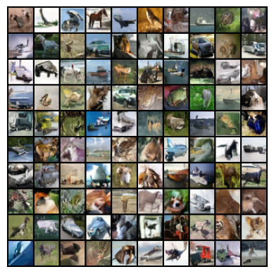

<p align="center">
  <picture>
    
  </picture>
</p>
<p align="center">
    <a></a>
    <a></a>
</p>
<h3 align="center">
    <p>Understanding Generative AI By Building It From Scratch</p>
</h3>

## 🔥 Why Torchsmith?
Torchsmith is a minimalist library that focuses on understanding by building.
Torchsmith builds multimodal modern generative AI, such as autoregressive and
diffusion models trained on image, text, and image-text pairs.

Torchsmith is built using basic [PyTorch](https://pytorch.org/) operations,
without relying on high-level abstractions.

Here you will find a bare-bones implementation of various building blocks of
modern-day machine learning such as [attention](https://arxiv.org/abs/1706.03762),
positional encoding, transformers,
learning rate schedulers, various text and image tokenizers, to name a few.

Torchsmith was inspired by [Berkeley's CS294-158](https://sites.google.com/view/berkeley-cs294-158-sp24/home).

## 🎬 Torchsmith In Action

### Image Generation

Image-space [diffusion](https://arxiv.org/abs/2006.11239) with [U-Net](https://arxiv.org/abs/1505.04597) and
[latent diffusion](https://arxiv.org/abs/2112.10752) with [Diffusion Transformer (DiT)](https://arxiv.org/abs/2212.09748)
on the [CIFAR 10](https://www.cs.toronto.edu/~kriz/cifar.html) dataset.

<p align="center">
    
    
    
</p>
<p align="center" style="font-size: smaller; color: gray;">
    Fig. (Left) Original images from CIFAR 10 dataset.
    (Center) Unconditional samples generated by UNet using image-space diffusion.
    (Right) Class conditional samples generated by DiT using latent diffusion.
</p>

### Image-Text Generation

[GPT2](https://cdn.openai.com/better-language-models/language_models_are_unsupervised_multitask_learners.pdf)-style image-text generation decoder trained on the [Colored MNIST dataset](https://github.com/rll).
The model can be used to generate:
1. Unconditional image-text pairs
2. Text-conditioned images
3. Image-conditioned texts


<p align="center">
    
</p>
<p align="center" style="font-size: smaller; color: gray;">
    Fig. For each image in the left-most column, only the non-darkened pixels are
    given as input to the GPT2 image-text model. To generate a sample,
    the model performs image completion followed by text captioning the contents of
    the completed image. Each row then shows the 4 samples i.e. 4 image-text pairs
    generated by the model.
</p>


### Text Generation

GPT2-style text generation decoder trained on [Eminem lyrics](https://huggingface.co/datasets/huggingartists/eminem):

```text
Sample #1
What, Im gonna get stay back to exam to stay
My dogs are crazy after nice playin to death
You know that wasnt spakin four
Thats my daughter, you wanna get score
Play if youre that videos
Oh, whoa, cause I wanna get so f***** circus
And someone and

Sample #2
And its feelin youse right!
Wouldnt f*** you to your kill: But you talk about me
Its about to have you still smack me
You talk to you think thats the shit you aint got some brains thats even you
When you hear on the floor, Im hardly startin to kill you!
```


### Representation Learning with VAEs

Variational Autoencoder ([VAE](https://arxiv.org/abs/1312.6114)) with convolutional
encoder and decoder to learn rich latent representations on Colored MNIST and
[SVHN](http://ufldl.stanford.edu/housenumbers/) datasets.

<p align="center">
    
    
</p>
<p align="center" style="font-size: smaller; color: gray;">
    Fig. Walking the VAE latent space.
    Samples generated after linearly interpolating between a starting and
    endpoint in the latent space.
    Each row represents walking in the latent space with the left-most column as the
    starting point and the right-most column as the endpoint.
    (left) Colored MNIST dataset (right) SVHN dataset.
</p>

---

## ✨ Features

- 🧠 **Modality Agnostic Autoregression Trainer**

  A modular and minimal model trainer that works seamlessly across:
  - Text generation
  - Image generation
  - Multi-modal tasks: Text-to-Image and Image-to-Text


- 🎨 **Diffusion Trainer For Images**
  - Image Diffusion (diffusion in pixel space)
  - Latent Diffusion (diffusion in latent space e.g. using VQ-VAE as encoder)


- 🔁 **VAE For Images**
  - Convolutional Variational Autoencoder to learn a meaningful and compact latent
    space. The VAE can also be used to generate new samples.


- 🤖 **Implementation Of Modern Generative Architectures From The Ground Up**
  - Modality agnostic GPT2
  - UNet for images
  - DiT (Diffusion Transformer) for images


- 🧾 **Tokenizers For Text**
  - Character-level tokenizer
  - Word-level tokenizer
  - Byte Pair Encoding (BPE)
    - Efficiently implemented using Python iterators and joblib


- 🛠️ **Primitive Operations**
  - Core components like attention, MLPs, positional encodings, and layer norms are
    implemented from first principles
  - No reliance on `torch.nn.Transformer` or other high-level attention
    blocks


- 🧪 **Test-Driven Development**
  - Full suite of unit tests ensuring correctness and stability
  - Easy to extend and experiment without breaking things


- 📋 **Best Practices For Code Development**
  - Uses [`uv`](https://github.com/astral-sh/uv) for dependency management
  - Enforces style and formatting with [`pre-commit`](https://pre-commit.com/) and
    [`ruff`](https://github.com/astral-sh/ruff)

---

## 🔬 Experiments

### [Autoregression] Colored MNIST With Text Labels
This experiment involves using GPT2-style decoder trained with autoregression.
In addition to the results shown in [this section](#image-text-generation), here
are detailed results:

<p align="center">
    
</p>
<p align="center" style="font-size: smaller; color: gray;">
    Fig. Unconditional image-text pair generation.
</p>


<p align="center">
    
</p>
<p align="center" style="font-size: smaller; color: gray;">
    Fig. Generated images conditioned on text "dark red {DIGIT} on light cyan" where
    DIGIT takes
    on values of the digit names from 1-9 (e.g. "dark red one on light cyan", etc.).
    The model conditions the generated image on the text.
</p>


<p align="center">
    
</p>
<p align="center" style="font-size: smaller; color: gray;">
    Fig. Generated images conditioned on text "plain red {DIGIT}" where DIGIT takes
    on values of the digit names from 1-9 (e.g. "plain red one", "plain red two", etc.).
    Note that the model first completes the text to determine the background color
    ("plain red one" -> "plain red one on dark green") and
    then goes on to generate the corresponding image.
</p>


### [Diffusion] CIFAR 10

In addition to the results shown in [this section](#image-generation), here
are detailed results:

#### UNet Experiments

<p align="center">
    
    
    
    
    
</p>
<p align="center" style="font-size: smaller; color: gray;">
    Fig. CIFAR 10 samples generated after 4, 16, 64, 256, and 512 denoising steps
    (from left to right). Notice
    how the details in the generated samples are proportional to the number of
    denoising steps.
</p>


<p align="center">
    
    
    
    
    
</p>
<p align="center" style="font-size: smaller; color: gray;">
    Fig. Unconditional CIFAR 10 samples generated after epoch 1, 5, 15, 30 and 60
    (from left to right). Sampled images consist only of high-frequency noise as seen
    after
    epoch 1 but details begin to appear and images become coherent as the training
    progresses.
</p>

#### Diffusion Transformer (DiT) Experiments


<p align="center">
    
    
    
    
    
</p>
<p align="center" style="font-size: smaller; color: gray;">
    Fig. Class-conditioned CIFAR 10 samples generated with no classifier free
    guidance (CFG),
    classifier free guidance with weight 1.0, 3.0, 5.0 and 7.5 (from left to right).
    Larger values of the CFG weight improve the faithfulness of the generated image
    to the class. With too large weights, the samples begin to lose diversity and
    collapse to similar looking samples.
</p>


<p align="center">
    
    
    
    
    
</p>
<p align="center" style="font-size: smaller; color: gray;">
    Fig. Unconditional CIFAR 10 samples generated after epoch 1, 3, 5, 30 and 60
    (from left to right). Sampled images become coherent and detailed as the training
    progresses.
</p>


<p align="center">
  
  
</p>
<p align="center" style="font-size: smaller; color: gray;">
  Fig. (left) Cosine learning rate scheduler with warmup. (right) Train and test losses.
</p>


### [Autoregression] Poetry

Here are some samples that are generated by GPT2 model trained on the [poetry dataset](https://huggingface.co/datasets/merve/poetry):
```text
Sample #1
Long Pystand Pelite: 191[Dweven
Pestate known that they recicish or latt.
Untrunter-vain-his and-lifes.

Sample #2
With lover blowdes and stake a the shade unto more,
The gively . This daight that I dispure.
Revaliants stempeted golding of t

Sample #3
Dramters my not be and mensuck'd withat might and of this,
Then with an shike of sturn
Of wift be my kimery arm thing fair dre
```


### [Autoencoders] VAE


#### Colored MNIST

The Colored MNIST dataset is modeled using a convolutional VAE with a
32-dimensional latent space.

<p align="center">
    
    
    
</p>
<p align="center" style="font-size: smaller; color: gray;">
    Fig. (left) 50 pairs consisting of the original image (from the Colored MNIST
    dataset) and reconstructed image.
    Reconstruction is performed by first encoding and then decoding the original image.
    (center) Colored MNIST
    samples generated after linearly interpolating between a starting and
    endpoint in the latent space.
    Each row represents walking in the latent space with the left-most column as the
    starting point and the right-most column as the endpoint.
    (right) Colored MNIST
    samples generated by randomly sampling the latent space followed by
    decoding.
</p>

#### SVHN
The Street View House Numbers dataset is modeled using a convolutional VAE with a
16-dimensional latent space.

<p align="center">
    
    
    
</p>
<p align="center" style="font-size: smaller; color: gray;">
    Fig. (left) 50 pairs consisting of the original image (from the SVHN dataset) and
    reconstructed image.
    Reconstruction is performed by first encoding and then decoding the original image.
    (center) SVHN samples generated after linearly interpolating between a starting and
    endpoint in the latent space.
    Each row represents walking in the latent space with the left-most column as the
    starting point and the right-most column as the endpoint.
    (right) SVHN samples generated by randomly sampling the latent space followed by
    decoding.
</p>

---

## 📦 Installation

```bash
# Clone the repo
git clone https://github.com/ankitdhall/torchsmith.git

# Option 1: Install using uv
uv pip install ./torchsmith

# Option 2: Install using pip
pip install ./torchsmith
```

---

## 🧰 Usage Examples

### 💪 Training
Training scripts for various datasets and models can be found in the `examples/`
directory.

For example:
```bash
python examples/train_eminem.py
```

### 🎨 Generating Samples

```python
import huggingface_hub

from torchsmith.models.gpt2.decoder import GPT2Decoder
from torchsmith.tokenizers.mnist_tokenizer import ColoredMNISTImageAndTextTokenizer
from torchsmith.tokenizers.mnist_tokenizer import (
    colored_mnist_with_text_conditioned_on_text,
)
from torchsmith.utils.plotting import plot_images
from torchsmith.utils.pytorch import get_device

text = "plain orange seven on dark blue"
num_samples = 4

tokenizer = ColoredMNISTImageAndTextTokenizer()
path_to_weights = huggingface_hub.hf_hub_download(
    "ankitdhall/colored_mnist_with_text_gpt2", filename="model.pth"
)
transformer = GPT2Decoder.load_model(path_to_weights).to(get_device())

decoded_images, decoded_texts = colored_mnist_with_text_conditioned_on_text(
    num_samples=num_samples,
    text=text,
    tokenizer=tokenizer,
    transformer=transformer,
)
plot_images(
    decoded_images, titles=decoded_texts, max_cols=int(num_samples ** 2)
)
```

---

## 🧪 Test-Driven Development

Torchsmith strives for test-driven development and uses `pytest` for testing.
The tests cover most of the codebase.

First install packages needed for testing:
```bash
# Option 1: Install using uv
uv pip install ./torchsmith[testing]

# Option 2: Install using pip
pip install ./torchsmith[testing]
```

To run the tests:
```bash
pytest tests/
```

To generate and save (saved to `.badges/`) the test coverage badge run:
```bash
./scripts/generate_badges.sh
```

---

## 🧑‍💻 Contributing

When contributing changes, please:
- Add tests for new features, improvements and bug-fixes.
- Follow the existing coding style.

Torchsmith uses pre-commit hooks to ensure clean and consistent code:
```bash
pre-commit install
pre-commit run --all-files
```

---

## 🚧 TODOs

- [ ] Experiment with learning rate schedulers
- [ ] No-code way to train using declarative YAML config
- [ ] Experiment with VQ-VAE
- [ ] Support LoRA and fine-tuning utilities
- [ ] Find bigger GPUs and experiment on larger datasets
- [ ] Experiment with different positional embeddings


## Acknowledgements
Inspired by:
- Works such as [minGPT](https://github.com/karpathy/minGPT) and [nanoGPT](https://github.com/karpathy/nanoGPT).
- [Berkeley's CS294-158 Deep Unsupervised Learning](https://sites.google.com/view/berkeley-cs294-158-sp24/home). Also, thanks to them for the
  Colored MNIST dataset and the pre-trained VQ-VAEs.
